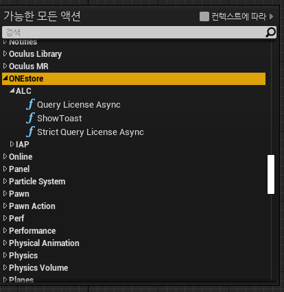
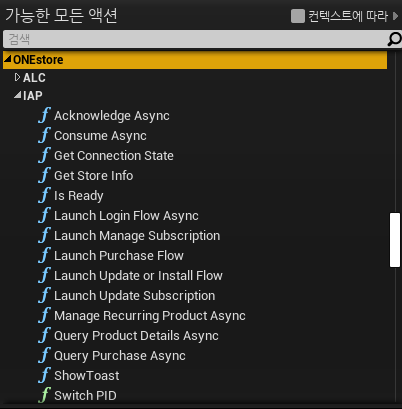

# ONEstore BluePrint Plugin for UnReal Engine

>This module is a Blueprint plugin sorce for Unreal created to support ONEstore ALC(App License Checker) and IAP(In-app Purchase SDK).
>    * ONEstoreALC : support v2. 
>    * ONEstoreIAP : support v21.

  
# Environment
   ### The environment for this document is as follows:
>* NDK : 21.4.7075529
>* UnReal v4.25.4
>* Microsoft Visual C++ 2017

  
# Folder Structure
>   - Plugins
>       - ONEstoreALC
>           - Resources
>               -icon128.png
>           - Source
>               - ONEstoreALC
>                   - ONEstoreNativeALCHelper
>                       - include
>                           - ONEstoreAlcCallbacksListener.h
>                           - ONEstoreAlcEngine.h
>                           - ONEstoreAlcError.h
>                       - libs 
>                           - arm64-v8a   / libONEstoreNativeAlcHelper.so
>                           - armeabi-v7a / libONEstoreNativeAlcHelper.so
>                           - x86         / libONEstoreNativeAlcHelper.so
>                           - x86_64      / libONEstoreNativeAlcHelper.so
>                       - gradle-wrapper.properties
>                       - ONEstoreALC.jar
>                   - Private 
>                       - ONEstoreALC.cpp
>                       - ONEstoreALCBase.cpp
>                       - ONEstoreALCQueryLicenseAsync.cpp
>                       - ONEstoreALCStrictQueryLicenseAsync.cpp
>                   - Public
>                       - ONEstoreALC.h
>                       - ONEstoreALCBase.h
>                       - ONEstoreALCQueryLicenseAsync.h
>                       - ONEstoreALCStrictQueryLicenseAsync.h
>               - ONEstoreALC.Build.cs
>               - ONEstoreALC.UPL.xml
>           - ONEstoreALC.uplugin
>            
>       - ONEstoreIAP
>           - Resources
>               -icon128.png
>           - Source
>               - ONEstoreIAP
>                   - ONEstoreNativeIapHelper
>                       - include
>                           - ONEstoreIapCallbacksListener.h
>                           - ONEstoreIapEngine.h
>                           - ONEstoreIapEnums.h
>                           - ONEstoreIapError.h
>                           - ONEstoreIapObject.h
>                           - ONEstoreIapProductDetail.h
>                           - ONEstoreIapPurchaseData.h
>                           - ONEStoreIapResult.h
>                       - libs
>                           - arm64-v8a   / libONEstoreNativeIAPHelper.so
>                           - armeabi-v7a / libONEstoreNativeIAPHelper.so
>                           - x86         / libONEstoreNativeIAPHelper.so
>                           - x86_64      / libONEstoreNativeIAPHelper.so
>                       - gradle-wrapper.properties
>                       - ONEstoreIAP.jar
>           - ONEstoreIAP.uplugin
> 
>  - Reference
>     - images
>        - ALC.png
>        - IAP.png
>        - Screenshot.png
>     - ONEstoreSample.uasset

  
# How To Build( Windows )
>
> 1. create C++ UnReal Project.
>
> 2. copy Plugins/*.*  to unreal_project/Plugins/*.*
>
> 3. unreal_project.uproject file -> context menu -> "Generate Visual studio project files" click in explorer.
>
> 4. refresh project and build in Visual Studio
>
> 5. open UnReal project using UnReal Editer
>
> Now you can find and use ONEstore BluePrint on the asset you want to use.

  
# How To Use
>ONEstore BluePrint Plugin is a module designed to use ONEstore ALC and IAP sdk using blueprints in UnReal projects. 
>For a detailed description of each API, please refer to the One store Developer Site( https://dev.onestore.co.kr ). 
>
>A sample of each BluePrint module is included in the ScreenShot.png and ONEstoreSample.uasset 
>The ScreenShot image is very big size, please download and use it. 
>
>* ALC Plugin 
></img>  
>* IAP Plugin 
></img>  
>* ALC & IAP Plugin Full ScreenShot(ONEstoreSample.uasset) 
></img> 
>
> * if you copy Reference/ONEstoreSample.uasset to the project/Content/ONEstoreSample.uasset, you can refer samle BluePrint in the UnReal Editor.

  
# Notice
>* If you have build issues, please see the UPL.xml file in the module.
>* If you have any questions, please contact the One store Developer Site( https://dev.onestore.co.kr ).

  
Thanks for reading.
